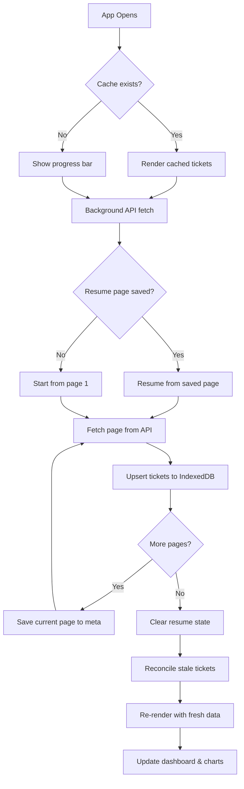
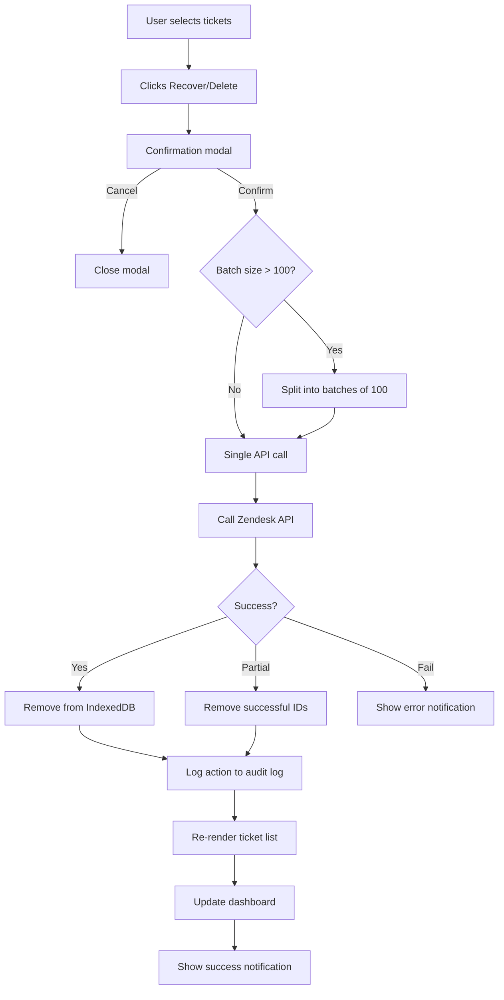
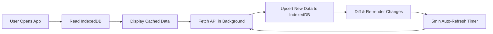

# Suspended Tickets Triage Center

> Zendesk sidebar app for triaging suspended tickets — bulk recover/delete, trend charts, IndexedDB caching, search, and action audit logs. Built with ZAF SDK and Zendesk Garden CSS.

A powerful triage interface for Zendesk administrators to manage suspended tickets efficiently. The app provides instant access to suspended tickets with local caching, bulk operations, analytics dashboards, and a complete action audit trail.

---

## Features

### Core Functionality
- **Suspended Ticket List** — Browse all suspended tickets with virtual scrolling (handles thousands without freezing)
- **Bulk Recovery & Deletion** — Select multiple tickets and recover or delete them with one click
- **Search & Filter** — Full-text search across subject, author, content; filter by cause; sort by date or subject
- **Ticket Preview** — Expand any ticket to see full content, author details, and cause without leaving the app

### Analytics Dashboard
- **Summary Cards** — At-a-glance counts for total, spam, automated, and other suspension causes
- **Trend Chart** — 30-day bar chart showing daily suspension volume
- **Cause Breakdown** — Doughnut chart visualizing the distribution of suspension reasons
- **Repeat Offenders** — Highlights authors with 3+ suspended tickets

### Performance & Caching
- **IndexedDB Cache** — Suspended tickets are cached locally in the browser for instant subsequent loads
- **Stale-While-Revalidate** — Shows cached data immediately, refreshes from API in the background
- **Resumable Loading** — If the app closes during a fetch, it resumes from the last page on next open
- **Progress Bar** — Visual progress indicator during first-time loading
- **Auto-Refresh** — Automatically syncs every 5 minutes

### Audit & Export
- **Action Log** — 30-day history of all recover/delete actions with timestamps
- **CSV Export** — Export filtered ticket list or action log as CSV
- **Log Export** — Download the complete action history for compliance

### Keyboard Shortcuts
| Key | Action |
|-----|--------|
| `/` | Focus search bar |
| `a` | Toggle select all (Tickets tab) |
| `r` | Recover selected tickets |
| `d` | Delete selected tickets |
| `j` / `k` | Scroll down / up |
| `Esc` | Close modal or preview |

---

## Architecture

```
┌────────────────────────────────────────────────┐
│                  Zendesk UI                     │
│  ┌──────────────────────────────────────────┐  │
│  │           iframe (sidebar app)            │  │
│  │                                           │  │
│  │  ┌─────────┐  ┌──────────┐  ┌─────────┐ │  │
│  │  │ app.js  │──│ api.js   │──│ ZAF SDK │ │  │
│  │  │ (ctrl)  │  │ (fetch)  │  │ (auth)  │ │  │
│  │  └────┬────┘  └──────────┘  └─────────┘ │  │
│  │       │                                   │  │
│  │  ┌────┴────────────────────────────────┐ │  │
│  │  │         IndexedDB (cache.js)         │ │  │
│  │  │  ┌─────────┐ ┌────────┐ ┌────────┐ │ │  │
│  │  │  │ tickets │ │ meta   │ │ logs   │ │ │  │
│  │  │  └─────────┘ └────────┘ └────────┘ │ │  │
│  │  └─────────────────────────────────────┘ │  │
│  │                                           │  │
│  │  ┌────────────┐ ┌──────────┐ ┌────────┐ │  │
│  │  │virtual-list│ │ charts   │ │ search │ │  │
│  │  │ (scroll)   │ │(Chart.js)│ │(filter)│ │  │
│  │  └────────────┘ └──────────┘ └────────┘ │  │
│  └──────────────────────────────────────────┘  │
└────────────────────────────────────────────────┘
```

---

## Data Flow



## Bulk Action Flow



## Caching Strategy



---

## Project Structure

```
├── manifest.json              # ZAF app manifest (location, version)
├── package.json               # Project metadata
├── assets/
│   ├── iframe.html            # Main entry point loaded in sidebar
│   ├── logo.png               # App icon (128x128)
│   ├── logo-small.png         # Small app icon (32x32)
│   ├── css/
│   │   └── app.css            # Custom styles (Garden CSS foundation)
│   └── js/
│       ├── app.js             # Main controller (ZAF init, UI, events)
│       ├── api.js             # Zendesk API wrapper (paginated fetch, bulk ops)
│       ├── cache.js           # IndexedDB caching layer (tickets, meta, logs)
│       ├── logger.js          # Action audit log + CSV export
│       ├── charts.js          # Chart.js trend & cause visualizations
│       ├── search.js          # Client-side search, filter, repeat offenders
│       └── virtual-list.js    # Virtual scrolling for large ticket lists
├── translations/
│   └── en.json                # English locale strings
├── ARCHITECTURE.md            # Technical architecture documentation
├── LICENSE                    # MIT License
└── README.md                  # This file
```

---

## Installation

### Option 1: Upload to Zendesk (Recommended)

1. Clone this repository:
   ```bash
   git clone https://github.com/mohdasim/zendesk-suspended-ticket-triage-custom-app.git
   ```

2. Create a ZIP file containing the app files:
   ```bash
   cd zendesk-suspended-ticket-triage-custom-app
   zip -r suspended-tickets-triage.zip manifest.json assets/ translations/
   ```

3. In Zendesk Admin:
   - Navigate to **Apps and integrations > Apps > Zendesk Support apps**
   - Click **Upload private app**
   - Upload the ZIP file
   - Click **Install**

### Option 2: Local Development with ZCLI

1. Install the Zendesk CLI:
   ```bash
   npm install -g @zendesk/zcli
   ```

2. Authenticate:
   ```bash
   zcli login -i
   ```

3. Serve locally:
   ```bash
   zcli apps:server
   ```

4. Open Zendesk Support and append `?zcli_apps=true` to the URL.

---

## API Endpoints Used

| Endpoint | Method | Purpose |
|----------|--------|---------|
| `/api/v2/suspended_tickets.json` | GET | List suspended tickets (paginated) |
| `/api/v2/suspended_tickets/recover_many.json?ids=` | PUT | Bulk recover tickets |
| `/api/v2/suspended_tickets/destroy_many.json?ids=` | DELETE | Bulk delete tickets |

---

## IndexedDB Schema

| Store | Key | Indexes | Purpose |
|-------|-----|---------|---------|
| `tickets` | `id` | `cause_id`, `created_at` | Cached suspended tickets |
| `actionLog` | `logId` (auto) | `action`, `timestamp`, `ticketId` | 30-day audit trail |
| `meta` | `key` | — | Sync state (lastFetchedAt, lastPage) |

---

## Technology Stack

- **ZAF SDK 2.0** — Zendesk App Framework for iframe communication and authenticated API calls
- **Zendesk Garden CSS** — Official Zendesk design system (bedrock, buttons, forms, tables, tags, utilities)
- **Chart.js 4** — Lightweight charting library for trend and cause visualizations
- **IndexedDB** — Browser-native storage for offline-capable ticket caching
- **Vanilla JavaScript** — No build step, no framework dependencies

---

## Browser Support

- Chrome 80+
- Firefox 75+
- Safari 14+
- Edge 80+

---

## License

MIT License. See [LICENSE](LICENSE) for details.

---

## Author

**Mohd Asim Suhail** — [GitHub](https://github.com/mohdasim)
